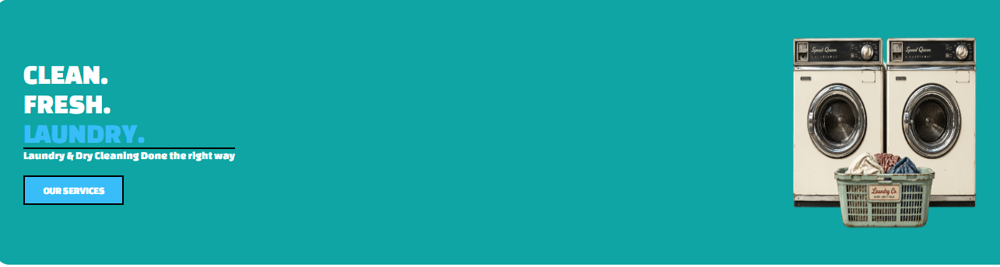
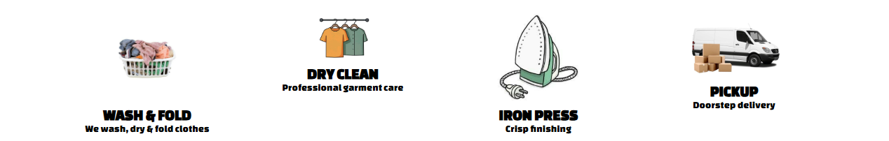
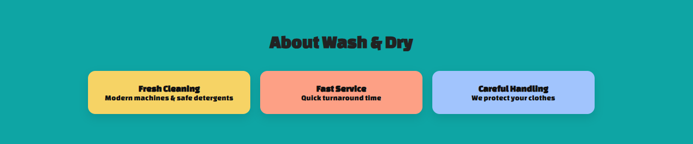
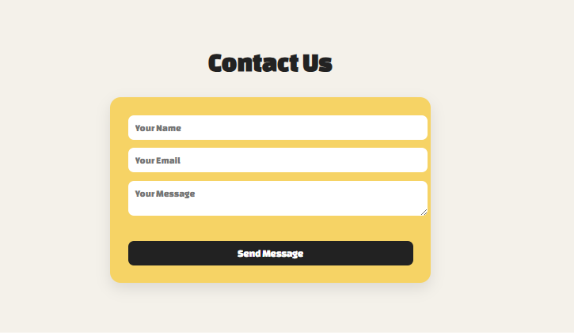

<!DOCTYPE html>
<html lang="en">
<head>
  <meta charset="UTF-8">
  <title>Wash & Dry Laundry README</title>
</head>
<body>

  <h1>🧺 Wash & Dry Laundry</h1>

  

    A responsive laundry service website built with <b>HTML5</b> and <b>CSS3</b>, designed to showcase services,
    business information, and provide a simple way for customers to get in touch.
  

  

  <h2>✨ Features</h2>
  <ul>
    <li>Hero section with call-to-action</li>
    <li>Services section (wash & fold, dry cleaning, ironing, pickup)</li>
    <li>About section highlighting the business</li>
    <li>Contact form (name, email, message)</li>
    <li>Simple navigation with anchor links</li>
    <li>Responsive layout</li>
  </ul>

  <h2>🛠️ Built With</h2>
  <ul>
    <li>HTML5</li>
    <li>CSS3</li>
  </ul>

  <h2>📸 Screenshots</h2>
    
    
    
    

  <h2>🎥 Demo Video</h2>
  

    <a href="https://youtube.com/your-video-link">▶ Watch Demo Video</a>
  

  <h2>🚀 How to Run</h2>
  <ol>
    <li>Download or clone the project</li>
    <li>Open <code>index.html</code> in any browser</li>
  </ol>

  <h2>🎯 Purpose</h2>
  

    This project was built to practice front-end development, layout design, and structuring a real-world business website.
  

</body>
</html>
